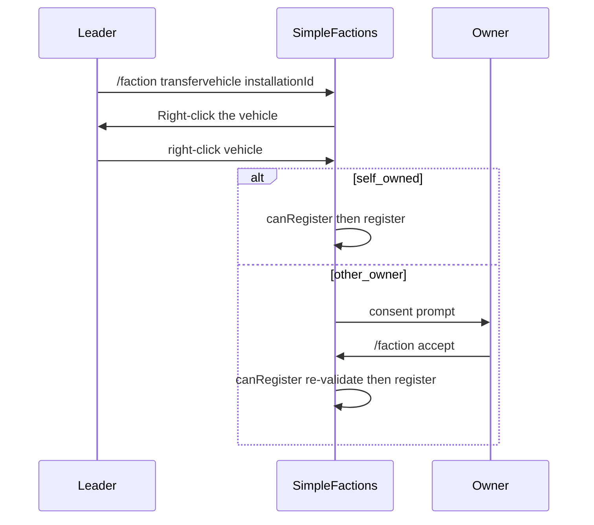

# Installations

> **Status:** Shipped. See [roadmap.md](./roadmap.md). Vehicle berths: [vehicles.md](./vehicles.md). Campaign raids: [campaign-raids.md](./campaign-raids.md).

Military **installations** are named structures a faction can build on owned land: forts, ports, and airports. Each **operational** installation appears on the political map via `installations[]` in `map_markers.json`. Under-construction installations are **not** exported. Settlements and installations are independent — a province may have both a city and a fort.

---

## Concepts

| Term | Meaning |
|------|---------|
| **Installation** | Named fort, port, or airport on a single province (operational) |
| **Construction** | In-progress build; max **one** per faction; not on map until complete |
| **Kind** | `fort`, `port`, or `airport` |
| **Province** | Block coords at construct time; one installation of each kind per province per faction |

**Invariants:**

- At most **one of each kind** per province per faction (many forts across different provinces OK).
- **Direct faction ownership only** — `provinceHandler.hasProvince(P)`; vassal/subject land does not qualify.
- Independent of settlements — settlement + fort + port + airport on the same province is allowed.

---

## Data model

### `installation.Installation`

| Field | Type | Notes |
|-------|------|--------|
| `id` | `String` | From `Formatter.formatId` |
| `name` | `String` | Display name (colour codes via hex formatter) |
| `kind` | `InstallationKind` | `FORT`, `PORT`, `AIRPORT` |
| `province` | `int` | Province id |
| `centerX` / `centerZ` | `int` | Player block coords at construct |
| `completedAt` | `long` | Epoch ms when construction finished (0 on legacy saves) |

### `installation.InstallationConstruction` (in-progress)

| Field | Type | Notes |
|-------|------|--------|
| Same as `Installation` | | id, name, kind, province, centerX, centerZ |
| `timeLeft` | `int` | Seconds until operational |
| `startedAt` | `long` | Epoch ms at enqueue |

Persisted on faction JSON as `installation queue` (single object or null).

### `installation.handler.InstallationHandler` (per `Faction`)

| Responsibility | Notes |
|----------------|--------|
| `byId` | Lookup by operational installation id |
| `byProvinceKind` | One operational per kind per province |
| `pendingConstruction` | At most one in-progress build |
| `construct` | Validate + enqueue construction |
| `tick` | Decrement `timeLeft` each second; complete at 0 |
| `deconstruct` | Remove operational installation or cancel pending build |
| `payDailyUpkeep` | Daily pass in `Faction.newDay()`: withdraw upkeep or dissolve (cheapest first) |
| `onProvinceLost` | Wilderness / no new owner: cancel pending + dissolve operational on province |
| `InstallationTransferService.transfer` | New owner exists: cancel pending on that tile; move completed installs; VF leader sync when a live berthed vehicle exists |
| `validate()` | Cancel pending / dissolve if province no longer owned |
| `serialize()` / `load()` | Operational installations |
| `serializeConstruction()` / `loadConstruction()` | Pending build |

---

## Command

Player stands in the target province. Block coords taken from player location.

### `/faction construct <fort|port|airport> <name...>`

Leader only (`FactionManager.getByLeader`).

| Check | Behaviour |
|-------|-----------|
| Kind valid | `fort`, `port`, or `airport` |
| Name | Non-blank after trim |
| Ownership | Faction directly owns province |
| Duplicate | No existing installation of same kind on province |
| Land | Province valid and not sea/water |
| Port only | Within `port-sea-proximity-blocks` of sea or river |
| Unique id | No duplicate `id` within faction |
| Queue | Faction not already building another installation |

On success: enqueue construction (province+kind reserved). Leader sees time remaining. Installation registers and map updates when `timeLeft` reaches 0.

### `/faction deconstruct [id]`

Leader only.

| Form | Behaviour |
|------|-----------|
| No args | Opens **Installations** GUI (`INSTALLATIONS_VIEW`) |
| `<id>` | Opens confirm GUI for that installation or pending build |

Deconstruct always requires GUI confirm (green/red). Tab-complete includes pending ids.

### Faction GUI

Implemented in `Managers/Inventory/InstallationView.java` and `InstallationCreator.java`.

| Entry | Detail |
|-------|--------|
| Hub slot **32** | Installations tab (`MenuItemType.INSTALLATIONS`, march icon) — summary counts + total upkeep |
| `SFGUI.INSTALLATIONS_VIEW` | List view — operational installations (green concrete), active build in slot 39 |
| `SFGUI.INSTALLATION_DETAIL_VIEW` | Detail lore + deconstruct button (leader only) |
| Confirm | `InventoryManager.confirmView` with key `installation` + installation id |

---

## Territory loss

**Wilderness / no new owner:** cancel any pending construction on that province and dissolve **all** operational installations on that province (`InstallationHandler.onProvinceLost`). Leader notified if online.

**New owner:** `InstallationTransferService.transfer` moves completed installs to the new faction and cancels pending construction on that tile. VF owner sync (`player_<newLeader>`) runs when a live berthed vehicle exists. Callers include prestige steal (`MapSystem.claim`: transfer then unclaim), de jure annex, `Guild.elevate`, `Faction.dissolve` into overlord, and war land apply after peace revert.

## Wartime occupation

Occupation lists on the war are **not** de jure owner changes. While a tile is occupied (or a siege takes the fort's own province), installs on that tile transfer to the occupying coalition's **war leader**. Snapshot `installationId -> originalFactionId` persists on the war. Recapture restores the snapshot original (vassal), not the recapturing war leader. Peace always reverts the snapshot first; then land apply may transfer again.

---

## Daily upkeep

Each **operational** installation costs `daily-upkeep` denars per faction day (from `InstallationConfigLoader`). Pending constructions are excluded until complete.

**Payment** runs in `Faction.newDay()` **after** army upkeep, **before** `guild.newDay()`:

1. Collect operational installations; sort by `dailyUpkeep` ascending, then `completedAt` ascending.
2. For each: if faction bank has enough → `withdraw(upkeep)`; else destroy installation (cheapest first when broke).

**Ledger** (`Cashflow.INSTALLATIONS`) on the base guild shows the daily expense total in the guild book GUI. Payment is **not** applied again at `settleIncome()` — same model as army upkeep.

Leader message on non-payment destroy: `… has been destroyed §7(unable to pay upkeep)`.

---

## Vehicle berth

Faction leaders can berth **player-owned** VehicleFramework vehicles at operational installations. Personal ownership is VF `player_<name>`. Berthed vehicles get an `INSTALLATION` row in `PlayerVehicleRegistry` (installation id + original owner), count against installation slot capacity, and use VF owner `player_<factionLeader>`.

### Command

`/faction transfervehicle <installationId>` — faction leader only. Tab-complete lists operational installation ids (same as deconstruct).

On success the leader receives: `§aRight-click the vehicle to transfer it to <installation name>.` A session is stored until the leader right-clicks a vehicle or the session expires (`transfer-request-timeout-seconds`).

### Flow



### Validation (`InstallationVehicleService.canRegister`)

Checks run in order; first failure stops the transfer:

| Check | Rule |
|-------|------|
| Owner | Vehicle VF owner must be `player_<name>` (not `none`) |
| Already berthed | Vehicle must not already have an `INSTALLATION` registry row |
| Category | Vehicle type must map to a `vehicles.yml` category supported by the installation kind |
| Capacity | Sum of vehicle `size` at installation for that category must not exceed `slots.<category>` |
| Radius | Vehicle horizontal XZ distance from installation center must be `<= radius` |
| Province | Vehicle must be in the installation's province |

**Category hosting** (which installation kind accepts which `vehicles.yml` category):

| Category | Installation host |
|----------|-------------------|
| `static_emplacements`, `land_vehicles` | fort |
| `ships` | port |
| `aircraft` | airport |
| `train` | none (personal only; `ignore-limit` on all train types) |

Berth capacity **sums vehicle `size`** per category at the installation. Personal slot limits (below) count **vehicles**, not `size`.

### Personal claim limits (`VehicleOwnerClaimedEvent` / `VehiclePreInteractEvent`)

Vehicles spawned outside VFBuilders (e.g. `/vf spawn`) become personal when VF owner is claimed from `none`. SimpleFactions listens and:

- **Allows** the claim when slot limits allow (no personal registry row is written; VF owner is the source of truth)
- **Skips** slot enforcement when the vehicle is already berthed (`INSTALLATION` row)
- **Cancels** `VehiclePreInteractEvent` and `VehicleOwnerClaimedEvent` when the type is unknown or personal slot limits are exceeded (owner stays `none`; interact does not continue into seats/containers)

Berthed vehicles keep `INSTALLATION` registry rows; VF owner sync to `player_<factionLeader>` does not fire this event.

### Other-owner consent

When the leader right-clicks another player's vehicle:

1. Owner must be **online**
2. Owner must be within `consent-proximity-blocks` of the **vehicle** (horizontal distance)
3. Pre-consent `canRegister` must pass
4. Owner receives consent prompt; leader receives confirmation that the request was sent
5. Owner accepts with `/faction accept` (owner need **not** be a faction leader)
6. Accept re-runs full `canRegister`; on success both players are notified

Request timeout uses `transfer-request-timeout-seconds`. Expired requests send: `§cVehicle transfer request expired or was cancelled.`

### VF owner sync

On berth, VF `ownerData` is set to `player_<faction.getLeader()>`. On `VehicleSpawnEvent`, `InstallationVehicleOwnerSync` re-applies the current leader if the registry row is still `INSTALLATION` and the VF owner is stale (e.g. after a leadership change).

VehicleFramework has no faction logic; SF registry (`INSTALLATION` + `installationId`) is the source of truth for **berths**. Personal ownership is VF `player_<name>`.

### Chat messages

| Situation | Message |
|-----------|---------|
| Command armed | `§aRight-click the vehicle to transfer it to <installation name>.` |
| Out of radius | `§cVehicle must be within <radius> blocks of <name> (currently <distance>).` |
| Wrong province | `§cVehicle must be in province <required> (currently <actual>).` |
| No capacity | `§c<installation name> has no space for <category> (<used>/<capacity> used).` |
| Unsupported category | `§cThis installation does not support <category> vehicles.` |
| Not owned | `§cThis vehicle must be owned by a player before it can be berthed.` |
| Already berthed | `§cThis vehicle is already berthed at an installation.` |
| Consent prompt (owner) | `§e<leader> wants to berth your <type> at <installation>. It will become a faction vehicle. §7/faction accept` |
| Owner offline | `§cThe vehicle owner must be online to transfer this vehicle.` |
| Owner too far | `§cThe vehicle owner must be within <n> blocks of the vehicle.` |
| Success | `§aVehicle berthed at <installation name>.` |
| Consent timeout | `§cVehicle transfer request expired or was cancelled.` |
| Not leader | `§cYou need to be a faction leader to transfer vehicles.` |
| Unknown installation | `§cUnknown installation id.` |
| No pending session | `§cYou are not transferring a vehicle. Use /faction transfervehicle <id>.` |

### Out of scope

- Installation GUI berth list / detail view
- Un-berth (return to personal ownership)
- Faction ledger charge for berthed vehicle upkeep (personal upkeep stops on berth only)

---

## Personal vehicle limits

When a player starts building a vehicle (`BeginVehicleConstructionEvent`), SimpleFactions enforces personal limits from [`vehicles.yml`](../src/main/resources/vehicles.yml) via `VehicleSlotGuard.checkCanBuild`.

| Rule | Detail |
|------|--------|
| Total cap | `personal-slot-limit` (shipped: 3); counts **vehicles**, not `size` |
| Per-type cap | `default-per-person` (shipped: 1) with per-type `per-person` override (e.g. land: 3) |
| Trains | `ignore-limit: true` skips the total cap; per-type cap still applies |
| `size` | Used for **installation** berth capacity only; does not affect personal slot counting |

**Check order:** known type in `vehicles.yml` → per-type cap → `ignore-limit` bypass → total cap (`personal-slot-limit: 0` = unlimited total).

### Construction chat messages

| Situation | Message |
|-----------|---------|
| Total cap | `§cYou have reached your personal vehicle limit (<n>).` |
| Per-type cap | `§cYou already have the maximum number of <type> vehicles (<n>).` |
| Unknown type | `§cThis vehicle type is not registered for faction upkeep.` |

`<type>` is the vehicle type id from config (e.g. `cloudskimmer`, `horse_cart`). `<n>` is the limit that was exceeded.

### Campaign battle vehicle eligibility

During **campaign battles** (`battle.warId != null`), berthable vehicles must be berthed at an installation **in play** for the player's faction:

```text
eligible iff NOT isBerthableType(vehicleTypeId)
 OR (
 registry row exists with mode == INSTALLATION
 AND installationId IN inPlaySet(playerFaction)
 )
```

Missing registry rows are **not** eligible for berthable types.

| In `inPlaySet` | Source |
|----------------|--------|
| Committed pick | Leader-selected **port** or **airport** for current `battleDay` |
| Defender ZOC port | Current naval slot `portInstallationId`, auto-committed for the defender war leader |
| Siege fort | Active schedule **`SIEGE`** slot `fortInstallationId` owned by that faction |

- **Trains** and other **non-berthable** types: always eligible as personal vehicles.
- Enforced by `BattleVehicleEligibilityService` on vehicle interact/spawn during campaign battles.
- Full pick rules: [Wars.md installation picks](./wars.md#installation-picks).

### Campaign installation picks

Faction leaders commit **ports and airports** for each battle day from the campaign war GUI (**Installations** button, slot 33). Only installations in provinces your coalition still controls are pickable. **Forts** are not pickable; the active **siege** on the campaign schedule puts the owning faction's fort emplacements in play automatically.

On a current naval slot, the defender war leader's **ZOC port** (`portInstallationId`) is auto-committed and cannot be unpicked. Other pickable ports and airports still toggle.

Picks lock at **vote close** on battle day. After lock, berth and unberth are blocked on **in-play** installs (see [vehicles.md](./vehicles.md#locks-during-battles-and-raids)). Empty pick means nothing from that faction's installations is in play except a required ZOC port. See [Wars.md](./wars.md#installation-picks).

### Campaign raid damage and repair

During **campaign raids**, installation structures and nearby blocks are protected unless the installation is **vulnerable**. Repair on the raid **target** is embargoed after the fight starts.

#### Damage gating

Enforced by `InstallationVulnerabilityService` and `InstallationProtectionListener`.

| Rule | Detail |
|------|--------|
| Default | Installation-tied blocks/entities within `installations.yml` **radius** (default 80) are **protected** from block break, explosions, and entity damage |
| **Vulnerable** when | Active campaign raid **source** or **target**; campaign battle installation in play (committed pick or siege fort); staff raid battle explicitly targeting the installation |
| Staff | Exempt from protection |

#### Repair embargo

Enforced by `InstallationRepairEmbargoService` when `installation_repair_embargo_enabled` is true; lock written at fight start by `CampaignRaidLaunchService`.

| Rule | Detail |
|------|--------|
| Scope | **Target installation only** (not source) |
| Area | Target province + installation radius |
| Start | When fight phase begins (muster end), not when raid completes |
| Duration | `war.campaign_raid.repair_lock_hours` (default **48**) from start |
| Blocks | Place and break for non-staff |
| Repeat raids | **Allowed** on same installation even if embargo active |
| After fight | Embargo **continues** until expiry |
| Toggle | `war.campaign_raid.installation_repair_embargo_enabled` (default **true**); set `false` to allow block repair immediately |

#### Vehicle berth (71.12)

Enforced by `VehicleInstallationLockService`.

| Rule | Detail |
|------|--------|
| Who | Vehicles with `OwnershipMode.INSTALLATION` (berthed) and new berths at the same installation |
| During battle/raid | Cannot berth or unberth if the installation is **vulnerable** (raid source/target, campaign battle in-play, staff raid target) |
| After vote close | Cannot berth or unberth on **in-play** installs: committed picks, defender ZOC port, siege fort. Other ports stay open. |
| After raid | **Target only** keeps the 48h lock for new berths |
| Repair | Always allowed (personal and berthed vehicles) |
| Staff | Exempt from berth lock |

#### Config (`war.campaign_raid`)

| Key | Default | Meaning |
|-----|---------|---------|
| `muster_seconds` | 60 | Join window after leader confirms source + target |
| `duration_seconds` | 600 | Fight timer after muster ends |
| `repair_lock_hours` | 48 | Post-raid lock duration (installation block repair when enabled; berth lock on target) |
| `installation_repair_embargo_enabled` | true | Block place/break on raid target during post-raid lock |
| `intruder_damage_interval_ticks` | 10 | Province intruder damage cadence |
| `intruder_damage_amount` | 4 | Damage per intruder tick |

---

## Dissolve

1. Remove from `byId` and `byProvinceKind`.
2. Enqueue map update.
3. Notify faction leader if online.

---

## Map export

See `Map/export/Markers.java` — `map_markers.json` per installation:

| Field | Source |
|-------|--------|
| `id` | installation id |
| `name` | display name |
| `kind` | `fort`, `port`, or `airport` (lowercase) |
| `faction_id` | owning faction |
| `province_id` | province |
| `center_x` / `center_z` | construct coords |

ProvinceSystem enriches `map_x` / `map_y` from `center_x` / `center_z` (1:1). Frontend renders fort/port/airport pins on political map modes.

### Fort ZOC export (`forts[]`)

Operational **forts only** (same set as `installations[]` where `kind == fort`). Map pins remain on `installations[]`; `forts[]` drives zone-of-control data and hatch overlays.

| Field | Notes |
|-------|--------|
| `id`, `name`, `faction_id`, `province_id` | Same as installation |
| `center_x` / `center_z` | Pin position |
| `zoc_provinces` | Sorted unique province ids — computed by `ZocRealm` |

**`zoc_provinces` rules:** fort province + one-ring **land** neighbors whose owner shares the **same top realm** (`RelationManager.getTopLiege` or faction id). Sea and unclaimed neighbors excluded.

**Active wars:** during a campaign war, who **controls** a fort's ZOC for siege gating may differ from installation owner (`fortControllers` on the war JSON). Siege winner becomes controller; installation DB ownership unchanged. **Map export is war-aware (shipped ):** when a fort is referenced on an active war and has a `fortControllers` entry, `zoc_provinces` is computed from that coalition's war leader realm; otherwise the installation owner is used. See [Wars.md](./wars.md#campaign-battle-schedule-locked).

#### PS + frontend

| Stage | Behaviour |
|-------|-----------|
| **PS `zocgen`** | Unions `zoc_provinces` pixel mask; tiles diagonal hatch → `output/{map}/zoc/{id}.png` + `defines/{map}/zoc_overlays.json` |
| **Triggers** | `map_markers` upload and `fullregen` |
| **API** | `GET /{map}/data/markers` → `forts[].overlay`, `zoc_url`, `map_x`/`map_y` |
| **Static** | `GET /{map}/zoc/{id}.png` |
| **Frontend** | Hover fort pin on political map modes → `hoveredFortZoc` hatch layer (separate from nation `hoveredOverlay`) |

Port and airport pins have no ZOC. Pending construction forts are excluded from `forts[]`.

---

## Config

**`plugins/SimpleFactions/installations.yml`** (loaded after [`vehicles.yml`](../src/main/resources/vehicles.yml) at enable):

```yaml
consent-proximity-blocks: 20
transfer-request-timeout-seconds: 60

fort:
 radius: 80
 daily-upkeep: 50
 construction-time: 10 # 432000 (5 days)
 slots:
 static_emplacements: 8
 land_vehicles: 2
port:
 radius: 80
 daily-upkeep: 20
 construction-time: 10 # 259200 (3 days)
 slots:
 ships: 8
airport:
 radius: 80
 daily-upkeep: 35
 construction-time: 10 # 259200 (3 days)
 slots:
 aircraft: 10
```

| Field | Kind | Dev value | Production (comment) |
|-------|------|-----------|----------------------|
| `consent-proximity-blocks` | root | 20 | Owner must be within this many blocks of vehicle for consent |
| `transfer-request-timeout-seconds` | root | 60 | Transfer session and consent request expiry |
| `radius` | fort / port / airport | 80 | Horizontal berth distance from installation center |
| `daily-upkeep` | fort / port / airport | 50 / 20 / 35 denars per day | - |
| `construction-time` | fort | 10 seconds | 432000 (5 days) |
| `construction-time` | port / airport | 10 seconds | 259200 (3 days) |
| `slots.<category>` | per kind | see above | Capacity for vehicle category (sum of vehicle `size` when berthed) |

`slots` keys must match a category id in `vehicles.yml` (e.g. `ships`, not `ship`). Slot values are integer capacity (sum of vehicle `size` for berthed vehicles at that installation).

Loaded at enable by `InstallationConfigLoader` (fail loud if missing or unknown category). Access: `getDailyUpkeep(kind)`, `getConstructionTimeSeconds(kind)`, `getRadius(kind)`, `getConsentProximityBlocks()`, `getTransferRequestTimeoutSeconds()`, `getCategorySlotCapacity(kind, categoryId)`, `getCategorySlots(kind)`.

**`config.yml`** still holds `port-sea-proximity-blocks`. **`war.yml`** holds `war.port_sea_zoc_radius`. Installation upkeep/construction/slots live in `installations.yml`.

**Live servers:** copy `installations.yml` from the jar default; remove the old `installations:` block from `config.yml`. Add `land_vehicles: 2` under `fort.slots` when merging an existing file. Vehicle categories live in `vehicles.yml` (see [`AGENTS.md`](../AGENTS.md) for package layout).

### `vehicles.yml` personal-limit keys

Loaded at enable by `VehiclesConfigLoader` (before `installations.yml`).

| Key | Location | Rule |
|-----|----------|------|
| `personal-slot-limit` | root | Total personal cap; `0` = unlimited; counts vehicles not `size` |
| `default-per-person` | root | Default per-type cap when type omits `per-person` |
| `default-upkeep` | root | Optional fallback when type omits `upkeep` |
| `upkeep` | per type | Required unless `default-upkeep` present |
| `size` | per type | Installation berth units only |
| `per-person` | per type | Overrides `default-per-person` |
| `ignore-limit` | per type | When `true`, type does not count toward total personal cap |

Access: `getPersonalSlotLimit()`, `getDefaultPerPerson()`, `getPerPersonLimit(typeId)`, `ignoresPersonalSlotLimit(typeId)`, `isKnownType(typeId)`.

`port-sea-proximity-blocks` is active (default 20).

---

## Package layout

```text
installation/
 Installation.java
 InstallationKind.java
 InstallationKindConfig.java
 InstallationConstruction.java
 InstallationBounds.java
 handler/
 InstallationHandler.java
 ConstructResult.java
vehicles/
 InstallationVehicleService.java
 InstallationVehicleOwnerSync.java
 VehicleIntegrationListener.java
 VehicleRegistryClaimService.java
 VehicleRegistryClaimListener.java
 VehicleTransferListener.java
 VehicleTransferConsentService.java
 VehicleSpawnListener.java
 VehicleIntegrationListener.java
 VehicleTransferSessionManager.java
 VehicleTransferMessages.java
 VehicleConstructionMessages.java
 VehicleSlotGuard.java
 CanBuildResult.java
 VehicleCategoryRules.java
 PlayerVehicleRegistry.java
 VehicleTypeConfig.java
 …
Loaders/
 InstallationConfigLoader.java
 VehiclesConfigLoader.java
Managers/Inventory/
 InstallationView.java
 InstallationCreator.java
Database/
 InstallationData.java
 InstallationConstructionData.java
```

---
