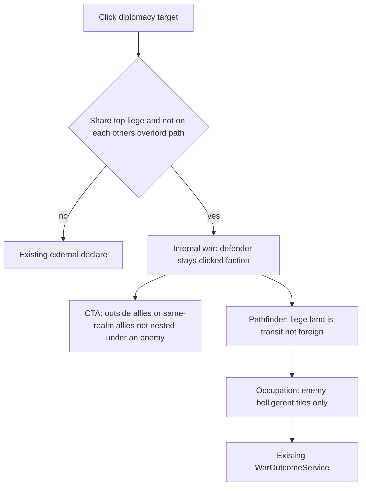

# Inter-vassal wars - lock

**Repo:** `simplefactions`  
**Status:** shipped (batches 1-5). Batch plan: [01-batches.md](./01-batches.md)  
**Phase:** [war-goals-apply/01-phases.md](../war-goals-apply/01-phases.md) Phase 8  
**Canonical gameplay:** [wars.md](../../wars.md)

CK3-shaped **internal wars**: two factions under the same top liege fight each other. The liege is **not** a participant. Not a civil war (no temp rebels, no `endVassalage` at declare, no realm split).

Player-facing strings: no em dash. Use `-` or `:`.

Do **not** invent a second diplomacy, pathfinder, or occupation engine. Extend `WarGoalValidator`, CTA (`War.canBeCalled` / `WarManager.sendRequest`), and pathfinder foreign-land rules.

---

## Architecture lock

| Piece | Choice |
|-------|--------|
| Internal war | Attacker and defender share `getTopLiege`, and `sameRealm` is **false** (not on each other's overlord path). Helper: `InterVassalQueries.isInternalPeerWar(a, b)`. |
| Defender | **Clicked faction.** Do not retarget to the king. (Usurp vs direct overlord stays the existing vertical exception.) |
| Liege | Not a main, not auto-included, **not callable**. No realm-wide civil-war border lock. |
| Subjects | Unchanged: each **main's direct subjects** auto-join. Nested = levy-only. |
| CTA | Same rules for **all wars**. Eligibility service; do not special-case only internal. |
| Transit | For internal wars only, non-belligerent land whose owner shares that top liege is **crossable** (same as wilderness on land pass). Not belligerent. |
| Occupation | Existing bulge on **enemy-owned** tiles. Do not occupy liege transit. |
| Apply | Existing `WarOutcomeService`. Subjugate vs a peer uses `transferSubject` then chosen type (defender already has an overlord). |
| Civil war | Unchanged. Independence / overthrow still movement → `CivilWarStartService`. |

`RelationManager.sameRealm` stays vertical-only. Do not expand it to "same king." Peer wars are the hole `sameRealm` already leaves; validator and CTA must use the shared-top-liege query instead of punching `sameRealm` true.

---

## Who can declare

Allowed when **all** hold:

1. Shared top liege (`getTopLiege` equal, both have an overlord).
2. Not `sameRealm` (not liege/vassal/nested of each other).
3. Shared declare blocks that still apply: already at war, ally, NAP stub, tributary rules, manpower, navy gate after populate.
4. Goal is allowed for internal wars (below).

Forbidden:

- Own direct or nested subjects (that is civil war / independence).
- The overlord (except existing **Usurp** vs **direct** overlord).
- A nested subject of the other party (`sameRealm`).

Cousin wars (your count vs their duke, neither on the other's path, same king) **are** allowed.

---

## Goals

Same picker as external, except:

| Goal | Internal |
|------|----------|
| Tributary, open market, change government, pillage, generic **War**, de jure annex, transfer subject, subjugate | Allowed if existing eligibility holds vs the **clicked** defender (not the king) |
| Usurp | **No** (still overlord-only) |
| Overthrow / change law / change tax | **No** (movement / civil war) |

**Subjugate a peer:** they become the attacker's subject and stay under the king as nested. Apply: `RelationManager.transferSubject(defender, attacker)` then `setRelationForced` to the chosen type if it differs. Do not use independent-style `setRelationForced` first: `vassalCheck` would fail (they already have the king).

**De jure:** transfer provinces in the title owned by the **defender's realm** (the peer and their subjects), not the king's demesne.

**Pillage:** settlement picker vs the peer; range / sea rules unchanged.

---

## Call to arms (all wars)

A faction **J** may be called by a participant **C** only if **all** hold:

1. `J` is in **C**'s ally map (`ally` relation). The list is still built on the **main participant** at `Participant` construct; the war leader must be allied to `J`.
2. `J` is **not** already participating (`War.isParticipating`: mains, their direct subjects, joined secondaries).
3. `J` is not the shared top liege of an **internal** war, and not the overlord of any **main** on either side.
4. `J` is not nested under any **enemy** faction (overlord path hits an enemy participant).
5. `J`'s **top liege** is not a **main participant** on either side. (If that nation is already a main, their vassals are covered or you would call them against their liege.)

Callable examples:

- A third vassal of the same king who is your ally.
- A vassal of a **neutral** foreign nation (their king stays out).

Not callable:

- The overlord / king.
- Vassal of an enemy main, or nested under an enemy.
- Vassal whose top liege is already a main on **your** side.

`War.canBeCalled` today is `!attackers.isParticipating || !defenders.isParticipating` (almost always true). Replace with `!isParticipating(j) && CallToArmsEligibility.canCall(war, caller, j)`.

Decline CTA: existing **-30%** stability. No new penalty.

Joined allies stay **secondaries**, not extra mains. Their direct subjects are not auto-fighters (existing levy rules).

---

## Campaign pathfinder

Belligerent set stays participants (mains + direct subjects + called allies).

**Internal war only:** a land province owned by a faction that:

- shares the war's top liege, and
- is **not** a belligerent

is **liege transit**. Land pass treats it like **wilderness** (crossable, gray on the route). It is **not** attacker/defender occupation, not ZOC of the fighters, not a fort-control steal of the king.

External wars: unchanged (foreign nation still blocks land pass).

Navy gate still uses the generated schedule. If the only path is sea, they still need a port.

---

## Occupation and peace

`OccupationService` already occupies enemy-owned tiles. Liege transit is not enemy-owned: **do not** add it to `occupied_by_*`.

Wartime installation transfer follows occupation as today. Peace: revert snapshot, then apply.

No civil-war border lock on the king or on uninvolved siblings.

---

## Out of scope

- NAP (shipped)
- Council-forced peace (diplomacy)
- Declare codes (last)
- Expanding `sameRealm` to mean same king
- Auto-calling the liege or turning internal wars into civil wars
- Flattening called allies' subjects into fighters
- Airborne pillage (not a feature)
- Retargeting **external** declares to top liege (separate cleanup; do not mix into this phase)

---

## Code touchpoints

| Area | Today |
|------|--------|
| Declare | `WarGoalValidator.validateShared` (`sameRealm`), `WarManager.declareWar`, `DeclareWarView` |
| Queries | `RelationManager.getTopLiege`, `sameRealm`, `getOverlord`, `isOnOverlordPath`, `getAllies` |
| CTA | `War.canBeCalled`, `War.call`, `WarManager.sendRequest` / `acceptRequest` |
| Path | `BelligerentTerritory.isForeignNation`, `ProvincePathfinder` land pass |
| Occupy | `OccupationService` enemy-owned bulge |
| Apply | `WarOutcomeService`, `RelationManager.transferSubject` |

Suggested new types (keep in `War/declare` or `War/core`, not a 5-line package): `InterVassalQueries`, `CallToArmsEligibility`.
