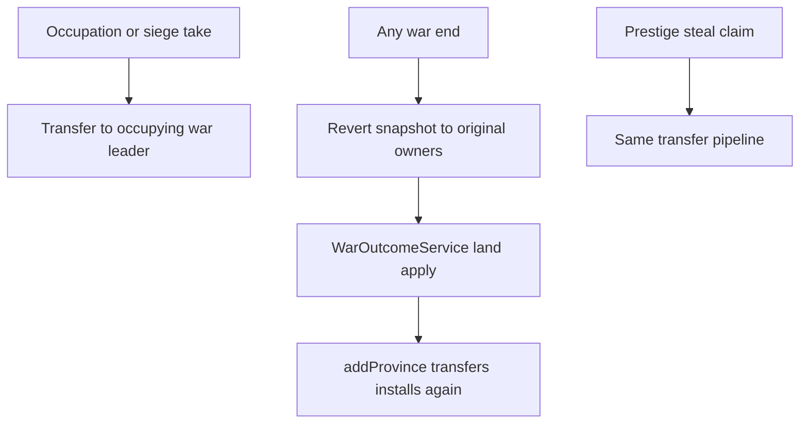

# Naval battles, installation transfer - lock

**Repo:** `simplefactions`  
**Status:** Phase 1 implemented (exit met). Phase 2 (civil wars) implemented (exit met).  
**Canonical gameplay:** [wars.md](../../wars.md), [installations.md](../../installations.md), [vehicles.md](../../vehicles.md)

This lock covers (1) installations following province ownership, including wartime occupation then peace revert, (2) naval declare/push as **facility only**, defender **ZOC port auto-commit**, attacker **empty-navy auto-loss**, berth freeze after pick lock, (3) civil wars as Phase 2.

**Batch plans:** [01-phase-1.md](./01-phase-1.md) (Done), [02-phase-2.md](./02-phase-2.md) (Done).

Player-facing strings: no em dash. Use `-` or `:`.

---

## Architecture lock

| Piece | Choice |
|-------|--------|
| Install ownership | Follows **province owner**. One transfer service. Do not dissolve when a new owner exists. |
| Wilderness unclaim | No new owner: dissolve (today's `onProvinceLost` behaviour). |
| VF owner | Berthed vehicles: `player_<faction.leader>` via existing `InstallationVehicleOwnerSync`. |
| Upkeep | `InstallationHandler.payDailyUpkeep` of the faction that currently holds the handler row. |
| Wartime occupation | Temporary transfer to occupying **war leader**. Snapshot original owner on the war. Does not change de jure province owner. |
| Peace | **Always** revert snapshot first. Then `WarOutcomeService` land apply (if any) uses the same transfer. |
| Naval declare / push | Operational **port** only (`CampaignNavyGate` / `InstallationNavyQueries.hasOperationalPort`). Empty port is allowed. |
| Naval ZOC port | `ScheduledCampaignBattle.portInstallationId` from `CampaignBattlePlacer.placeNaval`. Defender auto-commit, cannot unpick. |
| Attacker naval launch | At least one committed port with **berthed naval vehicles**, or auto-loss + initiative spent. |
| Berth after pick lock | No berth / unberth on **in-play** installs. Other ports stay open. |

Do not invent a second installation or vehicle engine. Do not gift coastal tiles or spawn fake ports.

---

## Installation transfer (one pipeline)

Today `InstallationHandler.onProvinceLost` **dissolves** every install on the tile. That is wrong when the tile has a new owner (prestige steal, de jure annex, civil-war split).

**Rule:** move the handler row to the new faction and sync VF owner to that faction's leader.

Callers:

- `MapSystem.claim` steal path (`unclaim` then `addProvince`)
- `Faction.addProvince` / `removeProvince` when ownership changes to another faction
- War land apply (`WarOutcomeService` de jure and any later land goals)
- Civil-war land split (Phase 2)

Wilderness: `unclaim` with no taker still dissolves.

---

## Wartime vs peace

Occupation lists on the war are **not** de jure owner changes.

While a tile is occupied (or a siege takes the fort's province for control), transfer installs on that tile to the occupying coalition's **war leader** so they pay upkeep, can pick the port, and can use berthed vehicles.

Persist on the war: `installationId -> originalFactionId`.

**Every** `WarEndReason` (attacker win, defender win, white peace, admin end):

1. Revert **all** wartime transfers to the snapshot.
2. Then existing apply (`WarOutcomeService`). Land apply that calls `addProvince` transfers installs **again** for tiles the winner keeps.

White peace and admin end: step 1 only.

---

## Naval commits

Naval slots already store the ZOC port as `portInstallationId`.

### Defender

- That ZOC port is **auto-committed** and **cannot be unpicked**.
- They may still commit any other pickable ports and airports (same rules as today: under side control).
- Empty ZOC port is **not** auto-loss. The facility is in play.

### Attacker

- No install is auto-locked.
- They may commit any pickable ports and airports.
- For `NAVAL` / `NAVAL_INVASION` launch they need **at least one committed port with berthed naval vehicles**. Otherwise they **auto-lose**: treat as a fought loss, spend initiative (`CampaignBattleEndService.spendOffensiveFuel` / existing end path). Do not skip fuel.
- Both sides empty of official navy: attacker cannot contest (attacker loss, attacker fuel).
- Spam the **attacker war leader** in chat from battle day through launch while this would still auto-lose. After pick lock, keep pinging if the committed port(s) are still empty of berthed naval vehicles.

### Declare and push

Keep `CampaignNavyGate.canChallengeNaval` = operational port. No ship count at declare or Push/Hold. Copy: you need a port if the path is naval; source ships before the battle.

### Pick lock and berths

`BattleInstallationPickService.isLocked` at `vote_close_hour`:

- Picks frozen (already).
- **Also** no berth and no unberth on **in-play** installs: committed picks, defender ZOC port, active siege fort.
- Extend `VehicleInstallationLockService`. Raid/battle vulnerability embargo stays.
- Ports not in play stay open for the next battle day.

Launch hook: `CampaignBattleLaunchService` for naval kinds.

Official navy at launch: at least one berthed naval vehicle at an in-play **port** (committed or ZOC-locked). Personal unberthed ships do not count.

---

## Phase 2 pointer

Civil wars: [02-phase-2.md](./02-phase-2.md) (Done). Decline demands starts the war without `endMovement`. Defender win / white peace / admin: restore then empty movement; no auto reparations, no auto imprison. Staff `/war admin reparations` is the manual ledger path. Movement apply stays [war-goals-apply Phase 6](../war-goals-apply/07-phase-6.md). Overthrow / change law / change tax stay off the nation declare picker.

---

## Out of scope here

- Campaign raid rules (except existing target berth embargo)
- Airborne pillage
- Inter-vassal wars
