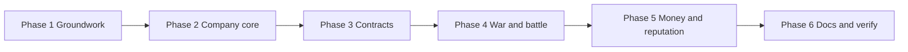

# War companies: phase plan

**Gameplay lock:** [00-index.md](./00-index.md)
**Canonical war spec:** [wars.md](../../wars.md)

This is the **implementation sequence**. Batches inside a phase can ship as separate PRs. Do not start the next phase until the current phase's exit criteria are met. Do not implement from this file; each phase has its own batch file.

Do not add a second economy, contract, modifier, or participant engine. Every piece of this program hangs off something that already exists: `Ledger`, `Loan`, `Upgrade`, `Regiment`, `GuildModifier`, `CreditCalculator`.

---

## Why this order

1. **Economy groundwork before companies.** Dividends and the guild-to-player money leg are small, independently useful, and mercenary wages cannot be paid without the second one. Doing them first means the company phases never have to invent a payment path under deadline.
2. **The company must exist before it can be sold.** Slots, enlistment and upgrades are self-contained and testable with no war involved.
3. **Contracts before war.** A contract is a stateful object with validation, money and a book. Getting it right in isolation is much easier than debugging it through a live battle.
4. **War participation last among the mechanics.** It is the only part that touches `Side`, `BattleLivesService` and `BattlePoolService`, so it should land when everything it depends on is stable.
5. **Money and reputation after participation**, because reputation depends on attendance outcomes and the active wage depends on battles having happened.

Phase 1 batch 1 (recruitment rule) is independent of everything else and can ship on its own at any time.

---

## Phase 1 - Groundwork

**Batch plan:** [02-phase-1.md](./02-phase-1.md)

Small, separable items that the rest of the program leans on, plus two cleanups.

### Batches

1. **Army recruitment rule.** Read `Rules.CAN_RECRUIT_PROFESSIONAL_ARMY` at the expansion entry point. Non-levy regiments blocked when false.
2. **Guild to player money leg.** `playerPayouts` and `pendingDividendPools` on `DailyGuildTransfers`, plus **Phase 4** of `settleIncome()` after guild banks are applied. Credits go to `Accounts.BANK` through `DenarEconomyPlayerBank.PlayerBank`. Outflows are clamped to post-Phase-3 wealth.
3. **Dividends.** `getDividendBase()` with the three dividend cashflows excluded, the pool/tax/split math, the three ledger arms, the guild GUI button, previous-tick membership check. Settlement consumes the payout leg.
4. **Home settlement stamps.** Companies, guilds and factions display their home settlement name.
5. **Cleanups.** `/ledger` hint on the guild ledger item; drop `Mercenary Company` from `tiers.yml`.

### Exit

- A guild can set a dividend percentage, members receive it at the daily tick, and the faction collects dividend tax on it.
- Dividend payout is provably not circular: a test asserts the base excludes the dividend entries.
- A guild can pay a player at the daily tick through the transfer buffer, atomically with guild transfers.
- Levy-only factions cannot expand professional regiments.

---

## Phase 2 - Company core

**Batch plan:** [03-phase-2.md](./03-phase-2.md)

The company as an entity: it exists, it has slots, it has people, it has upgrades. No contracts, no war.

### Batches

1. **Entity and persistence.** Company object on the guild, formation cost and 24h timer, name, banner, leader follows guild leader, one per guild. New data class and database round-trip.
2. **Mercenary regiment type.** `mercenary: true` flag on `Regiment`, filtered out of `Military`'s constructor so factions never see it. Company holds its own regiment instance.
3. **Slots and expansion.** 24h expansion via `MilitaryExpansion`, persisted across restarts, blocked while an unfilled slot exists, 8 d/slot/day upkeep on the host guild.
4. **Enlistment.** Invite command, accept/decline, one company per player, leader can kick, cannot enlist beyond slot count. Disabled character-trait hook.
5. **Upgrades.** `max-level` on `Upgrade`; `MAX_HEALTH`, `MAX_MANA`, `MANA_REGEN` on `GuildModifier`; three company upgrades in YAML.
6. **Stat application.** MMOCore/MythicLib service copied in shape from `SpellModifierApplyService`. Applied only inside a battle as a hired mercenary. Stripped on end, abort, death, disconnect.
7. **GUI.** Company screen, slot screen, roster screen, upgrade screen, daily burn total, buff-scope warning on every upgrade item.

### Exit

- One company per guild, formed for 100 d after 24 h, with 1 slot.
- Slots expand in 24 h, survive a restart mid-expansion, and refuse to expand with an unfilled slot present.
- A player can be in exactly one company and can be kicked.
- Upgrades cap at level 10 and never apply stats outside a mercenary battle. Verified by a disconnect-mid-battle check leaving no residual modifier.

---

## Phase 3 - Contracts and market

**Batch plan:** [04-phase-3.md](./04-phase-3.md)

### Batches

1. **Contract object.** All locked fields, a kind discriminator for assassins later, config minimums, the absence-refund floor validation, max 14 days. Persistence.
2. **Reservation calendar.** Overlapping-window slot accounting so a company cannot over-promise. Not a running total.
3. **Loyalty validation.** Company-level host-faction check via `Side.isParticipating`, player-level government check.
4. **Offer flow.** Propose, counter, accept, decline, expire. Signed book via the `LoanBook` shape, stamped with reputation.
5. **Market.** `/mercenaries` list with slots, prices, reputation, home settlement. Local-only signing, any government member may sign.
6. **Termination.** Duration elapsed, company under slots, host bankrupt, loyalty conflict. Each with the locked outcome.

### Exit

- A contract below a config minimum, over 14 days, with an absence refund under the per-battle price, or over-promising an overlapping window is rejected with a specific message.
- A company cannot be hired against its host faction, directly or through nested relations.
- The loyalty re-check fires on faction-joins-war, relation change, and government change, and terminates without a breach refund or reputation change.
- Hiring from outside the home settlement is refused.

---

## Phase 4 - War and battle

**Batch plan:** [05-phase-4.md](./05-phase-4.md)

### Batches

1. **Third participant kind.** Separate list on `Side` with persistence. `Participant` untouched.
2. **War display.** Companies listed with promised-slot soldier counts, distinct from main and secondary.
3. **Battle roster.** Hired mercenaries join the correct side; a mercenary whose faction is also belligerent counts as a mercenary first.
4. **Attendance.** Present at start and present at end, where end means on the roster at resolution. Per-slot result recorded on the contract.
5. **Lives.** Mercenary regiments contribute only for filled and attending slots, from the battle-start roster. Lives stay shared and the `Set<UUID>` subtraction stays single.
6. **Battle accrual.** Every started battle accrues the per-battle price, and absent slots accrue the absence refund.

### Exit

- A company appears in the war screen as a mercenary, not as an ally.
- Lives match `livesPerRegiment * (faction committed + attending merc slots) - unique roster fighters`, floored, with no double subtraction for dual-role players.
- A mercenary who logs out and returns before resolution passes attendance; one who never returns fails it and generates a refund.
- A battle day accrues both the day price and the battle price.

---

## Phase 5 - Money and reputation

**Batch plan:** [06-phase-5.md](./06-phase-5.md)

### Batches

1. **Five guild cashflows plus one player cashflow.** Push-only, absolute amounts, flags per the lock.
2. **Settlement wiring.** `populateDailyTransfers` arms for each, capital to host guild for contract money, host guild to player for wages.
3. **Active wage.** Percentage of slot earnings, base plus per-player override, attendance-gated per battle.
4. **Peacetime wage.** Flat per day, base plus per-player override, paid with or without a contract.
5. **Reputation.** `MercenaryReputationCalculator` in the shape of `CreditCalculator`, 0..100 default 50, the four locked events, coloured display, persisted.
6. **Burn display.** Daily burn on the company screen; bankruptcy consequences spelled out.

### Exit

- A full contract cycle moves money in both directions and every leg appears as its own ledger line with the right sign.
- Mercenary income and refunds are never netted together.
- A test asserts no new cashflow reads another guild's ledger.
- 20% base at config minimums yields exactly 2 d/day and 10 d/battle per soldier.
- Full attendance raises reputation, partial lowers it proportionally, early breach hits hard, loyalty termination does nothing.

---

## Phase 6 - Docs and verify

**Batch plan:** [07-phase-6.md](./07-phase-6.md)

Update `wars.md`, `roadmap.md`, `TODO.md`, config documentation, and run the in-game checklist.

---

## Explicitly not in these phases

| Item | When |
|------|------|
| Assassins | Next program, on the Phase 3 contract object |
| Character-trait gate enforcement | After the player to character migration (last) |
| Generalized non-faction `Participant` | Never |
| Ledger memoization | Not needed |
| Wages as taxable income | Deferred, default not taxable |
| PvP stats for regular guilds | Possible later; the `GuildModifier` entries make it cheap |
