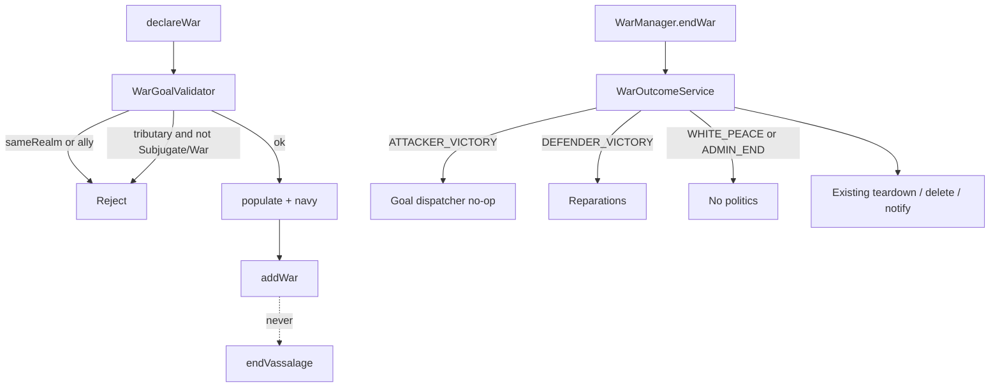

# Phase 1: Apply spine (batch plan)

**Phase:** [01-phases.md](./01-phases.md) Phase 1  
**Gameplay lock:** [00-index.md](./00-index.md)  
**Canonical:** [wars.md](../../wars.md)

No war-goal politics yet. After this phase, war end always goes through one applicator, diplomacy can be forced, declare cannot dissolve a realm, and a generic **War** goal can run a campaign with no apply.

Do **not** implement tributary/subjugate/usurp apply, de jure rewrite, pillage, or the movement gate.

## Exit (must all be true)

- Forced `setRelation` skips opinion and mutual request; unforced diplomacy unchanged.
- `declareWar` never calls `endVassalage` and never sets civil-war flags.
- Same-realm (existing `RelationManager.sameRealm`) and ally declares are rejected. Tributary declares are rejected except **Subjugate** and **War**. NAP is a stub (always allowed).
- `ATTACKER_VICTORY` runs the goal dispatcher (no-op for every current type, including **War**).
- `DEFENDER_VICTORY` applies reparations from the **attacker war leader** to the **defender war leader**.
- `WHITE_PEACE` and `ADMIN_END` apply neither goal nor reparations.
- Winning with an unimplemented goal does not throw and does not change relations.

## Behavior



---

## Batch 1 - Forced `setRelation`

**Done.** `setRelation(..., check, forced)`, `setRelationForced`, 5-arg wrapper stays unforced. Tests: `RelationManagerSetRelationTest`.

### API

[`RelationManager`](../../../src/main/java/me/Plugins/SimpleFactions/Managers/RelationManager.java):

- Keep `setRelation(Player p, RelationType r, Faction target, Faction origin, boolean check)` as a wrapper that calls the full method with `forced = false`.
- Add `setRelation(..., boolean check, boolean forced)` (return `boolean`: false if a structural check failed).
- Add `setRelationForced(RelationType r, Faction target, Faction origin)` → `setRelation(null, r, target, origin, false, true)`.

### Rules (lock)

| Always (forced or not) | Forced skips | Unforced keeps |
|------------------------|--------------|----------------|
| `vassalCheck`, top-overlord, loop (`isOnOverlordPath`) | Opinion `threshold` | Threshold messages + early return |
| `atLimit` | Mutual request (`r.isMutual() && check`) | `sendRequest` when mutual + check |
| Map enqueue, set type, linked reverse (`reverseChange` / `willReset`) | "Leader must be online" as a gate (today reverse already applies offline; do not add an online requirement) | Player chat when `p != null` |

Do not change GUI diplomacy callers. [`FactionManager.usurp`](../../../src/main/java/me/Plugins/SimpleFactions/Managers/FactionManager.java) and [`transferSubject`](../../../src/main/java/me/Plugins/SimpleFactions/Managers/RelationManager.java) can stay on `check = false` for now; later phases switch war/usurp paths to `setRelationForced`.

### Tests

New `RelationManagerSetRelationTest` (mock factions + relation types):

- Unforced + below threshold → no type change.
- Forced + below threshold → type changes.
- Unforced + mutual + `check true` → request sent, type unchanged.
- Forced + mutual → type changes, no request.
- Forced + `atLimit` → false, type unchanged.
- Forced + vassal loop / already has overlord → false.

---

## Batch 2 - Declare cannot start a civil war

**Done.** `declareWar` no longer calls `endVassalage` or sets civil-war flags. Shared declare blocks in `WarGoalValidator`: same-realm, ally, NAP stub, tributary unless `SUBJUGATE` or `WAR`. `RelationManager.isTributaryOf`, `hasNonAggressionPact`.

Without a same-realm block, vassal vs liege would declare and stay in the realm. Add the **shared declare rules** from the lock into [`WarGoalValidator.validateShared`](../../../src/main/java/me/Plugins/SimpleFactions/War/declare/WarGoalValidator.java) (not RelationView). RelationView still only gates "already in a war" before opening the picker.

### Shared checks (order)

1. Same faction (already).
2. Already at war / already allied in that war (already).
3. `RelationManager.sameRealm(attacker, defender)` → fail. **No usurp exception yet.**
4. `RelationManager.getAllies(attacker)` contains defender → fail.
5. NAP stub: `hasNonAggressionPact` always `false` (method may exist for later).
6. Defender is tributary of attacker → fail unless goal is `SUBJUGATE` or `WAR`.
7. Goal-specific validation (existing).
8. Military + navy stay in `declareWar` after this.

Use existing `sameRealm` (ancestor path). Sibling vassals are **not** same-realm today; do not invent inter-vassal rules here (Phase 8).

Do **not** retarget the defender to `getTopLiege` in this phase (that lands with nested transfer in Phase 2).

### Player copy (`§c`, no em dash)

| Case | Message |
|------|---------|
| Same realm | `You cannot declare war on a faction in the same realm.` |
| Ally | `You cannot declare war on an ally.` |
| Tributary | `You cannot declare war on your tributary.` |

Tributary detection: defender has a tributary relation **to the attacker** (diplomacy id `tributary` / suzerain link). Mirror however `getOverlord` finds overlords, for the tributary type, not vassalage.

### Tests

- `declareWar` never calls `endVassalage` (mock static verify).
- `validateShared` rejects same-realm and ally.
- Tributary + `SUBJUGATE` allowed; tributary + `DE_JURE_ANNEX` rejected.
- Independent non-ally still reaches existing goal validators.

---

## Batch 3 - End applicator + reparations

**Done.** `WarOutcomeService` on `WarManager.endWar` before teardown. Attacker victory: no-op goal switch. Defender victory: `WarReparationsService` obligation on attacker main guild, paid via `WAR_REPARATIONS*` cashflows. White peace / admin end: neither.

Suggested type: `War/resolution/WarOutcomeService.java` (name flexible). `WarResolutionService` already decides *whether* to end; it should not grow goal logic.

```
WarOutcomeService.apply(war, reason)
  ATTACKER_VICTORY -> applyAttackerGoal(war)  // switch on WarGoalType, all no-op
  DEFENDER_VICTORY -> WarReparationsService.apply(war)
  WHITE_PEACE, ADMIN_END -> return
```

`/war admin end` stays `ADMIN_END` (no reparations, no goal). That is correct.

### Reparations (defender win only)

Lock: % of **main guild** ledger income for **X days**, attacker pays, defender receives. Pipeline already has `Cashflow.WAR_REPARATIONS` / `WAR_REPARATIONS_PAYMENT` with TODOs in [`Ledger`](../../../src/main/java/me/Plugins/SimpleFactions/Guild/income/Ledger.java).

**Copy tribute**, do not invent a second tax engine:

- Attacker war leader main guild pays; defender war leader main guild receives (`buffer.add` like `TRIBUTE_PAYMENTS`).
- Base: same gross taxable income tribute uses (`getGrossTaxableIncome` on the payer main guild).
- Store a timed obligation on the **payer faction** (percent, days left, payee faction id). Tick down on the existing faction/guild new-day path; remove at 0.
- `getIncome` TODOs: payment = negative on payer; income = sum of incoming obligations on payee. Subsidiary guilds: 0 (same as tribute / overlord tax).

**Config defaults** (closes the wars.md open item for this phase; change later in config only):

```yaml
war:
  reparations:
    income_percent: 25
    days: 10
```

Load into `Cache`. Example in wars.md was 25%; days was unspecified, so 10 to match other short war timers.

Not on white peace, admin end, or attacker victory.

### Tests

- `apply(ATTACKER_VICTORY, SUBJUGATE)` does not call `setRelation` / `usurp`.
- `apply(WHITE_PEACE)` / `ADMIN_END` does not add a reparations obligation.
- `apply(DEFENDER_VICTORY)` adds obligation attacker → defender at config percent/days.
- Ledger income: payer negative, payee positive, non-main guild 0 (unit test with mocked guilds/obligation).
- Exhaustive switch on `WarGoalType` compiles (no-op arms).

---

## Batch 4 - Generic goal `War`

**Done.** Player-facing `War` in the declare picker (War, Subjugate, then conditional de jure / transfer). Shared rules including vs tributaries. Campaign populate like subjugate. Apply: dispatcher no-op. No `/war admin declare`. Ticket / declare-code filtering is later.

### Code

- `WarGoalType.WAR` json `war`. Display name `War`.
- `WarType.WAR` json `war`. [`warTypeForGoal`](../../../src/main/java/me/Plugins/SimpleFactions/War/core/WarDeclareHelper.java) maps `WAR` → `WarType.WAR`. Campaign populate: same as subjugate (not `RAID`).
- `config.yml` `war.goals.WAR.max_battles_per_leg` (same default 4).
- Validator: shared rules only; **allowed vs tributary**; no title/subject payload.
- Player GUI: [`DeclareWarCreator.createWarGoalItem`](../../../src/main/java/me/Plugins/SimpleFactions/Managers/Inventory/DeclareWarCreator.java); click finishes declare like Subjugate.

Do **not** add `Revolt` (Phase 7).

### Tests

- `fromJson("war")` round-trips.
- Validator: tributary target ok for `WAR`; same-realm still fail; independent `WAR` valid.
- Dispatcher no-op for `WAR` on attacker victory.

---

## Wire-up summary

| Site | Change |
|------|--------|
| `RelationManager` | `forced` flag + wrapper |
| `WarGoalValidator.validateShared` | same-realm, ally, tributary exception, NAP stub |
| `WarManager.declareWar` | drop `endVassalage` / civilWar |
| `WarManager.endWar` | `WarOutcomeService.apply` then existing teardown |
| `Ledger` | implement reparations cashflows from obligations |
| `WarGoalType` / `WarType` / `WarDeclareHelper` / config | `WAR` |
| `DeclareWarCreator` / `DeclareWarView` | War item always shown; click `finishDeclare` |

## Docs when done

- Mark Phase 1 done in `01-phases.md`.
- wars.md / 00-index: **War** is pickable with no apply; ticket codes later.
- Drop staff-only / player-GUI-unchanged wording.

## Out of scope

- Goal apply for subjugate / de jure / transfer / usurp / tributary
- `can-pick-for-war` YAML, subjugate type picker
- Top-liege retarget, nested transfer picker
- Usurp vs direct overlord
- Declare-code goal whitelist
- `Revolt`, NAP real relation, `endVassalage` revival
- `/war admin declare`
- Movement apply gate, pillage
- Changing `/war admin end` to attacker/defender victory (stay admin)

## Suggested PR order

Ship as four PRs in this order (2 depends on 1 only for later apply; 2 can follow 1 immediately). Batch 3 can follow 2. Batch 4 can merge with 3 if the enum churn is small.
