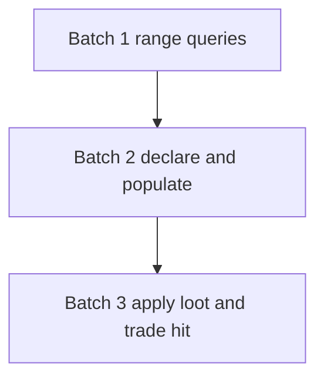

# Phase 5: Pillage (batch plan)

**Phase:** [01-phases.md](./01-phases.md) Phase 5  
**Gameplay lock:** [00-index.md](./00-index.md)  
**Canonical:** [wars.md](../../wars.md)

Short war: **one settlement**, **one battle**, apply loot + trade hit, war ends. Reuses Phase 0 `hasSeaConnection` and the existing navy declare gate. Distinct from campaign raids.

Do **not** implement the movement apply gate, airborne pillage, or campaign-raid changes in this phase.

Player-facing name **Pillage**. Code ids `pillage` (not `raid`). Existing `WarType.RAID` / `BattleType.RAID` stay campaign-raid and staff raid.

## Exit (must all be true)

- Pillage cannot be used as a substitute for campaign raids (different GUI, different apply, one-shot war).
- Airborne / deep-inland pillage stays out of scope: landlocked attackers and disconnected oceans cannot seaborne-pillage.
- Attacker victory pays snapshot loot and applies a decaying trade hit. Defender victory is reparations only. White peace / admin end apply neither.

---

## Spec locks for this phase

`wars.md` still lists exact **X** as an open item. Implementation is blocked without a number, so this phase **locks X in YAML** (tunable, not hardcoded):

| Key | Default | Meaning |
|-----|---------|---------|
| `war.goals.PILLAGE.range_provinces` (also `war.goals.pillage`) | `3` | Land hops. Same ballpark as `war.battle_cadence.provinces_between_battles`. |
| `war.goals.PILLAGE.max_battles_per_leg` | `1` | One fight. Counter leg is empty (no return battle). |
| `war.goals.PILLAGE.loot_days` | `10` | Snapshot multiplier for loot gold. |
| `war.goals.PILLAGE.trade_hit_percent` | `-100` | Starting trade-income modifier on hit guilds. |
| `war.goals.PILLAGE.trade_hit_days` | `10` | Decay window. Hourly, same cadence as `StabilityModifier` (`Government.powerTick`). |

### Range (batch 1)

Land BFS on **non-`Terrain.SEA`** provinces, using existing neighbour lists (same graph as `SeaConnectivity`, not a second map).

- **Land pillage:** from every **attacker-owned land** province, distance to the settlement **center** `<= X`. Adjacent to attacker land is distance `1`. A settlement on attacker land is not a valid target (shared declare / ownership).
- **Sea pillage:** settlement center is within **X** of the coast **and** `SeaConnectivity.hasSeaConnection(attacker, settlementOwner)`. Coast distance: BFS through land to a land province that has a `SEA` neighbour. A coastal center is distance `0`.
- **Settlement owner:** faction that owns the center province. `hasSeaConnection` uses that faction, not a vassal's overlord, so a landlocked vassal pocket on a disconnected ocean still fails.
- Candidate settlements: center owned by the **defender's realm** (same province set as subjugate: `TitleManager.getProvinces(defender)`). Not attacker-owned.
- Either land **or** sea rule is enough. Both may be true.

### Campaign shape (batch 2)

Normal populate still computes capital → border → settlement so the navy gate can see the path.

Then pillage **overrides the fight list**:

- Objective = selected settlement **center**.
- Invasion schedule: **one** battle at that center (not the usual keep-index-0 border trim).
- Counter schedule: **empty**. No return battle.
- **Navy gate:** if the **natural** (untrimmed) invasion schedule contains `NAVAL` or `NAVAL_INVASION`, reject declare with the existing blockade message even if the remaining fight is inland. Do not let a one-battle trim skip the port check.
- **End:** the single battle at the objective ends the war. Attacker win → `ATTACKER_VICTORY`. Defender win → `DEFENDER_VICTORY`. Do not wait for capital capture. `WarResolutionService.detectBattleVictory` needs a pillage arm; capital rules stay for other goals.

`max_battles_per_leg: 1` plus today's trimmer is **not** enough: the trimmer keeps the border fight and would never fight the settlement.

### Apply (batch 3)

Query existing `Ledger` / `Cashflow.TRADE` (`guild.getTradeBreakdown().getIncome()` via ledger). Do not add a second trade simulator.

- Guilds whose **capital province** is in the settlement (`Settlement.contains(guild.getCapital())`), including a base guild if the faction capital sits there.
- **Loot:** at resolution, sum those guilds' current TRADE income × `loot_days`. Deposit that gold on the **attacker's faction bank** (`Faction.getBank().deposit`). Spawned money; do not withdraw from the pillaged guilds.
- **Trade hit:** those guilds get a decaying modifier named `Pillage` starting at `trade_hit_percent`, ticking toward `0` on `powerTick` (same pattern as `StabilityModifier` after the both-sides decay fix). Apply as a multiplier on computed TRADE income in `ProvinceManager.getIncome` (or ledger `TRADE` read) so `Guild.newDay` deposits the reduced amount. No new trade-route engine.
- Hourly step: `abs(percent) / (trade_hit_days * hoursPerPowerTick)`. Match however often `powerTick` runs today (government stability).

---

---

## Batch 1 - Range queries

**Done.** `Cache.pillageRangeProvinces` from YAML `war.goals.PILLAGE.range_provinces` / `pillage` (default 3). `PillageRangeQueries` land BFS from attacker land, coast distance, and `canPillageSettlement` (land or sea + injected owner and realm set). No goal enum, GUI, or apply.

---

## Batch 2 - Declare + populate

**Done.** Layer 2 settlement picker, `targetSettlementId`, one FIELD battle at the center, empty counter, navy gate on the natural invasion path (`pillageNaturalNavyRequired`), war ends at that fight. Apply is batch 3.

---

## Batch 3 - Apply

**Done.** Snapshot TRADE for guilds with capital in the target settlement, spawn loot on the attacker faction bank (`loot_days`), attach a decaying `Pillage` trade hit persisted on the guild. Defender victory / white peace / admin do not loot or hit.

### Work

- `WarOutcomeService.applyPillage` on `ATTACKER_VICTORY` only.
- Snapshot TRADE, deposit loot, attach decaying `Pillage` hit on those guilds.
- Persist the hit (guild or faction serialisation) so restart does not wipe the 10-day decay.
- Config: `loot_days`, `trade_hit_percent`, `trade_hit_days`.
- Defender victory / white peace / admin: no loot, no trade hit (reparations already on defender victory).

### Tests

- Two guilds in settlement: loot = `(t1 + t2) * loot_days`; both get the hit.
- Guild capital outside settlement: ignored.
- TRADE multiplier at apply is `-100%` (income 0 that tick); after simulated ticks, hit is gone.
- White peace / admin: bank unchanged, no modifier.
- Defender victory: reparations path only.

### Files (expected)

- `WarOutcomeService`, guild/faction persist for the hit, `ProvinceManager.getIncome` (or ledger TRADE)
- `PillageApplyTest` / ledger-adjacent test

---

## Out of scope

- Campaign raids (`CampaignRaidService`, raid window, installation assaults)
- Airborne pillage (Phase 9 leftovers)
- Movement apply gate (Phase 6)
- Civil / inter-vassal wars
- Using `WarType.RAID` as the pillage war type
